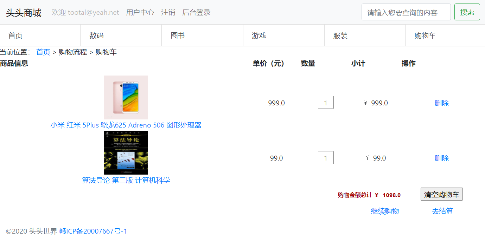

# 基于Servlet与JSP技术的电子商务网站的开发与部署
姓名：黄智权
学号：201836580388
## 设计思路
本系统基于Servlet与JSP技术设计，采用常用的MVC设计架构，系统分为若干个模块。

### 注册登录模块
该模块是电子商务网站的一个重要模块，起到判断用户身份的作用。本系统采用前台与后台分开部署的方式区分管理员与普通用户的界面，方便做权限区分。普通用户直接访问主页即可看到登录注册按钮，点击即可显示相应的登录与注册界面。管理员则通过系统导航栏的后台登录按钮进入后台界面登录。普通用户可以自行使用邮箱注册、登录，而管理员账号则直接通过后台数据库添加，管理员可以对商品信息、用户信息进行管理。

### 商品管理模块
商品管理主要包括商品的添加，修改，删除等。本系统采用不同的分类来管理不同的商品，在首页可以通过点击导航栏的分类按钮查看不同分类的商品。普通用户不需要登录即可查看浏览商品信息，为了方便用户有效查找商品，系统还包括了商品搜索部分，通过首页导航栏的搜索框即可按关键字搜索商品。

### 购物流程模块
该模块主要完成电商网站的重要环节，包括加入购物车、创建订单、删除订单、付款、通知发货、销售报表统计等重要功能，涵盖用户购物的全流程。用户想购买商品后，可以将商品加入购物车，在购物车界面可以查看当前选择购买商品的详细信息以及价格，当用户确定购买时，可以选择创建订单，创建订单后，用户需要尽快付款。管理员在后台可以取消未付款的订单。当用户付款后，管理员可以根据实际情况用邮件通知用户发货情况。系统会统计所有商品的销量、销售额，方便管理员对商品进行销量预测。


## 实验代码

### 数据库

本系统包含七个数据表，用途如下所述。

* 管理员用户表`ausertable`：保存管理员账号、密码。
* 普通用户表`busertable`：保存普通用户账号密码，用于登录、注册流程。
* 购物车表`carttable`：保存用户id、商品id以及商品数量，用于记录用户购物车内容。
* 商品表`goodstable`：保存商品价格、名称、类别、图片路径。
* 商品类型表`goodstype`：保存所有商品类型。
* 订单表`orderbasetable`：记录用户创建的订单，包含订单创建的用户、时间、是否付款等信息。
* 订单详情表`orderdetail`：记录订单详细包含哪些商品以及对应的数量。

详细创建数据包的SQL语句可参考`src/main/tootalmall.sql`文件。

### 数据操作

本系统使用基本的JDBC驱动来与Mysql进行交互，因此封装了基础的数据库操作，主要基础数据操作`BaseDao`、用户相关的数据操作`BeforeUserDao`、管理员相关的数据操作`AdminDao`。具体代码参考`src/main/java/dao`文件夹下文件。

考虑到可能有多个用户同时操作，因此本系统设计了数据库连接池，每次连接优先从连接池中选取已有的连接，若连接池中无连接再一次性创建多个连接，避免了频繁创建数据库连接。此外还封装了基本的数据查询与更新操作。

### 实体模型

本系统主要包括四个实体模型管理员实体`AdminDTO`、用户实体`UserDTO`、商品实体`GoodsDTO`、商品类型实体`GoodsTypeDTO`。实体类的编写均符合Java Bean的相关规范，与数据表中的数据项相对应，方便使用。具体代码参考`src/main/java/dto`文件夹下文件。

### 过滤器

由于部分功能需要对用户身份进行识别，如未登录用户不能注册，因此要对URL进行权限鉴别。本系统采用两个过滤器分别进行编码转换和URL鉴别。本系统文件代码、前后台交互文本编码均采用UTF-8编码。

URL过滤主要分为以下几个部分：

1. 静态资源：如图片文件、css样式文件、js脚本文件，默认放行 。
2. 后台JSP文件请求，login页面放行，其他页面需要判断后台是否登录。
3. 前台JSP文件请求，登录、注册、搜索页面放行，其他页面需要判断前台是否登录。
4. 前台servlet请求，对于登录、注册、商品信息、搜索等servlet放行，其他判断需要前台是否登录。
5. 后台servlet请求，登录servlet放行，其他判断后台是否登录。

详细过滤器代码参考`src/main/java/filters`文件夹下的代码。

### 服务层

根据MVC模型架构，需要在实体基础上封装一层服务层。本系统的服务分为两个服务，针对用户服务`BeforeUserService`，主要提供用户的注册、登录、查询商品、修改购物车等功能。针对管理员服务`AdminService`，主要提供管理员的登录、商品管理、类型管理、用户管理、订单管理、销售报表等功能。详细服务代码参考`src/main/java/service`文件夹下的代码。

### Servlet

Servlet是本系统的主要部分，通过调用其他部分，完成系统功能。总体分为两个部分，针对管理员的Servlet（位于admin文件夹下），针对用户的Servlet（位于before文件夹下）。

为了方便配置，本系统的Servlet均采用注解的方式配置URL映射，对于类似的功能，采用不同的参数进行区分。为了提高用户体验，本系统的部分Servlet返回字符串，前端通过ajax请求判断结果，避免了进行页面跳转，提高了交互效率。

管理员Servlet包括：添加/修改商品`AddGoodsServlet`，登录`AdminLoginServlet`，类型管理`AdminType`，删除商品`DeleteGoodsServlet`，商品详情`DetailServlet`，注销`LoginOutServlet`，订单管理`OrderManagerServlet`，商品查询`SelectGoodsServlet`，用户管理`UserManagerServlet`。

用户Servlet包括：获取商品详情`BeforeDetailServlet`，删除购物车`DeleteCartServlet`，获取商品列表`FirstServlet`，订单提交`OrderSubmitServlet`，支付`PayServlet`，放入购物车`PutCartServlet`，注册`RegisterServlet`，搜索商品`SearchServlet`，查询购物车`SelectCartServlet`，更新购物车`UpdateCartServlet`，用户中心查询订单`UserCenterServlet`，登录`UserLoginServlet`，注销`UserLogoutServlet`。

详细Servlet代码参考`src/main/java/servlet`文件夹下的代码。

### 工具类

本系统中的工具类主要为配置文件读取`MallProp`，邮件发送`SendEmail`，文件上传与下载`UploadDown`以及文件名格式化等小工具`MyUtil`。详细代码参考`src/main/java/util`文件夹下的代码。

### 前端

本系统前端主要采用JSP技术，同样分为两个部分，普通用户界面（位于`beforeUser`文件夹下），管理员用户界面（位于`admin`文件夹下）。系统主要使用`Bootstrap`样式库进行设计，实现了良好的用户体验。详细代码参考`src/main/java/webapp`文件夹下的代码。

### 其他

为了方便开发部署测试，本系统使用集成开发环境Intellj IDEA进行开发。使用Maven进行依赖管理，配置文件单独分离。使用log4j2进行日志输出。

## 功能测试

系统首页访问：


注册功能：


登录界面：


登录成功界面，按分类查询商品：


搜索商品：


商品详情界面：


购物车界面：



结算界面：


订单提交界面：


用户中心查询订单：


后台登录界面：


后台商品管理：


添加商品界面：


类型管理：


用户管理：


订单管理：


发送通知邮件：


邮件接收：


经过详细的测试，本系统基础功能完善，页面美观实用，具有良好的交互体验。

## 应用部署
部署本系统需要如下步骤：

1. 安装JDK8、Tomcat8、Mysql8环境。
2. 创建Mysql数据库、数据表。参考`src/main/tootalmall.sql`文件。
3. 在`src/main/resources`文件夹下创建配置文件`mall.properties`，内容类似如下：

```properties
# 头头商城配置文件

# 数据库配置
database.user=root
database.password=root
database.name=tootalmall

# 邮箱配置
mail.smtp.host=smtp.emample.com
mail.smtp.auth=true
mail.username=noreply@example.com
mail.password=eXaMpLePaSsWoRd
mail.smtp.port=465
mail.smtp.ssl.enable=true
```


4. 编译源代码，将构建的war包命名为`ROOT.war`上传到Tomcat的webapps目录下。

